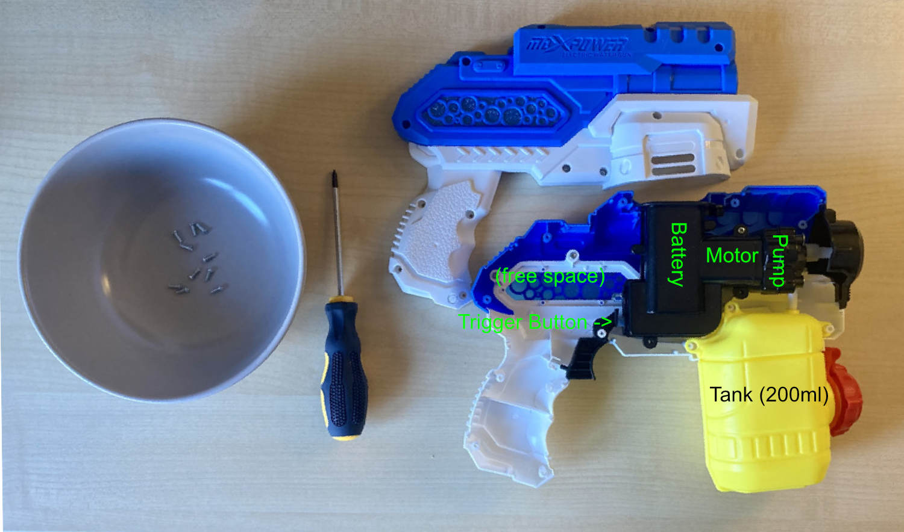
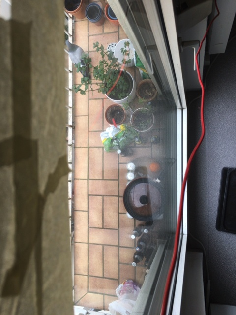
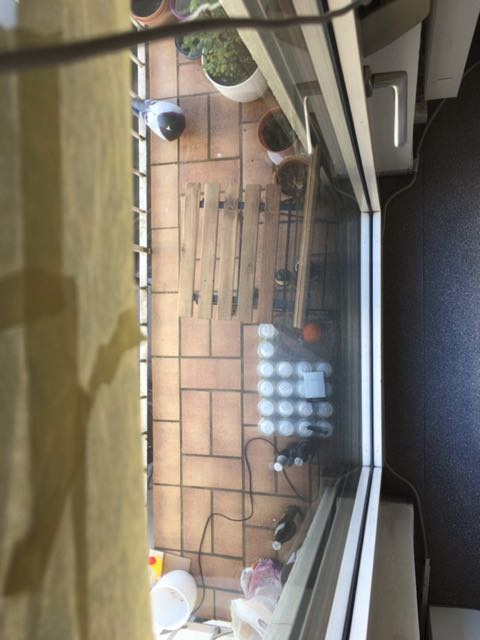

TL;DR: I built a wifi-equipped water gun to shoot 
the pigeons on my balcony, controlled over the internet by a
python script running openCV reading the camera image of my
old iPhone.

---

# Introduction

The pigeons in my backyard find particular pleasures in voiding their excrements onto my balcony. Dissatisfied with this situation, I went online to find a solution. I created a handy table to give you an overview of the vast number of ~~effective~~ _established_ ways to get rid if pigeons:

| Approach | Why it doesn't work |
|:--|:--|
| Plastic crows | Pigeons get used to them |
| Crow stickers | Pigeons get used to them |
| Reflective wind mills / CDs / ... | Pigeons get used to them |
| Sounds of animals (dogs, predators) | Pigeons get used to them |
| Dog and cat hair | Pigeons get used to them |
| Ultrasonic sounds | Hear me out: Even the people advocating for it admit that pigeons (like humans) are incapable of perceiving ultrasonic sounds. Instead they think that pigeons are [wavies](https://en.wikipedia.org/wiki/Electromagnetic_hypersensitivity) and that the mere presence of some imperceptible waves somehow distress the pigeons. You can't make this stuff up. As might be expected, nobody ever had any success with it. |
| Shooting pigeons | While it would certainly help coping with the distress of cleaning their crap, its highly illegal in Germany and even after one of my neighbours apparently tried it (I just saw the police leaflets) the number of pigeons didn't noticeably decrease. To be fair, some random neighbour with an air rifle is probably no comparison to the olympic pigeon killers [of the past](https://en.wikipedia.org/wiki/Shooting_at_the_1900_Summer_Olympics#Excluded_events).|
| Getting a cat | That should actually work if the cat has regular access to the balcony. But I don't have a cat and it would probably suicide itself in its attempt to hunt pigeons in the fifth floor. |
| Spikes | They work IFF you buy the right ones AND put them absolutely everywhere AND are careful to actually mount them correctly AND you don't plan to use the area covered yourself at all AND you don't even want to look at its disgraced looks. So it is completely pointless for a balcony.
| Nets | They work if you can tolerate their looks (I don't) and mount them correctly. In practice they are often mounted incorrectly so you have to remove dead or alive pigeons on a somewhat regular basis. |
| Scaring them away by shouting, water gun, clapping, etc. | Pigeons get used to it. Also you typically spend way too little time on the balcony to do keep them away permanently. But what if I outsourced the water gunning to some robotic contraption?|


After a quick burst of manic energy during exam phase, I decided to solve the pigeon problem on my balcony once and for all (and in a humane way). The idea was quite simple: Mount an electric water gun on my balcony, detect pigeons with a web cam and shoot them. Pigeons should not get used to getting sprayed at (at least not while its coldish), I don't have to disfigure my balcony and I'm not harming the pigeons in any way or even risk killing them. As I approached this project during my exam phase, it should also be quick to implement using things I already have  laying around.

# The Water Gun

I bought a cheap electric water gun [from Amazon](https://www.amazon.de/Wasserpistole-Elektrische-Wasserblaster-Wasserdicht-Wasserspielzeug/dp/B09578C69R/ref=sr_1_6?keywords=wasserpistole+elektrisch&qid=1650101643&sprefix=wasserpistole+ele%2Caps%2C147&sr=8-6) and tested it out: The range of around 3-4 meters is pathetic, but plenty for my balcony.

Next, I opened it up to figure out how to control it over the internet:



I chose one of my trusty Wemos D1 Mini boards as the brain if the 
water gun. They are small, cheap, offer Wifi and have some shields
available for them that ease cabling. In particular I'm using the 
relay shield. (Relays are basically electrically operated 
switches).
To control the water gun, I inserted a small paper contraption
in the battery department that allows me to break the gun's 
power and added a small hole for the cables: 


The microcontroller is powered by a USB power bank which is convenient, as the microcontroller does not drain the gun's battery (where
recheargable batteries don't fit (yes, really)), and the guns motor
can draw as much power as it wants without crashing the 
microcontroller. Also, it allows me to reprogram the Wemos if I 
mess up the wifi config ;)

# The Camera

I decided to use my old iPhone 6S as a camera: Its small, has a
battery, works without any configuration and most importantly: I 
had it at hand. After finding a suitable position on my window, I
designed a very simple holding bracket, 3D printed it and glued it
on my balcony window using [3M mounting tape](https://www.amazon.de/3M-VHB-Hochleistungsklebeband-schwarz-doppelseitiges/dp/B00EDLPG7Y/ref=sr_1_6?keywords=3M+tape&qid=1650114049&sr=8-6) [^tape].
I use [this app](https://apps.apple.com/de/app/ipcamera-high-end-networkcam/id570912928?l=en)
to get a MJPEG stream of its camera. It works good and 
I like that it lets you black out the display. As a final step,
I put masking tape on the window, so that the camera does not look
into my neighbours windows as that would be creepy.

# The Software

#### Image Analysis

The brains of the operation is a python script using openCV. It 
compares the current image to the normal background [^background].
If the average amount of change of all pixels is above some threshold, we fire the
gun. We use four small tricks to make this work reliably in practice:

1. If a pixel changed by less then 10% we don't count it as 0 in the calculation
2. If the amount of change if bigger than some threshold, we ignore it 
   (in this case someone touched the camera)
3. We add a mask over the image to exclude some flowers that move in
   the wind, as well as the reflections in the window. (Otherwise
   it gets triggered whenever someone comes close to the window)
4. After a movement was detected, wait for the movement to stop 
   (and the background to stabilise) again.

This heuristic works pretty reliably. 

The resulting code looks like this:

```python
    stream = CamGear(source="http://IP_OF_IPHONE/live").start()

    background = None
    while True:
        frame = stream.read()
        # apply mask
        frame = cv2.bitwise_and(frame, frame, mask=mask)

        # convert to grayscale
        frame = cv2.cvtColor(frame, cv2.COLOR_RGB2GRAY)

        if background is None:
            background = frame
            continue

        # update background
        background = cv2.addWeighted(
            background, background_alpha, frame, (1 - background_alpha), 0
        )

        # calculate difference to background 
        diff = cv2.absdiff(frame, background)

        # apply threshold to background
        _, diff = cv2.threshold(diff, 30, 255, cv2.THRESH_BINARY)

        score = np.mean(diff)
        if armed:
            if score > 10:
                # camera was moved
                time.sleep(10)
                armed = False
            elif score > 0.5:
                # PIGEON!
                armed = False
                time.sleep(1)
                frame = stream.read()
                cv2.imwrite(
                    f"{datetime.now()}.jpg", 
                    frame, # save a picture for later
                )


                requests.get("http://IP_OF_SERVER", timeout=1)

        else:
            # rearm if the image is stable again
            armed = (score == 0)
```
   
#### Networking

The first iteration used a HTTP server on the Wemos Board that 
triggered, whenever a request was received. This was 
straightforward and worked well, until I found out that the wifi
antenna on the Wemos is too weak to connect to my wifi from the
balcony. The solution was to connect the Wemos to my phones 
hotspot. The problem is, that now the Wemos and my laptop are now
in different networks so they cannot talk to one another directly.

I therefore wrote a small go program (the _reflector_) that 
accepts HTTP and TCP connections: Whenever it receives a HTTP 
request, it sends "PEW!" to one of the connected TCP clients 
(Usually there is only one). The code is pretty simple, the only 
tricky part is to ensure that reconnections are handled well. 
Go makes this easy with channels and goroutines:

```go
func main() {
	channel := make(chan byte, 42)
	http.HandleFunc("/", func(w http.ResponseWriter, r *http.Request) {
		if len(channel) == 0 {
			channel <- 42
		}
	})

	go http.ListenAndServe(":4242", nil)

	sock, err := net.Listen("tcp", ":4243")
	handle(err)

	for {
		conn, err := sock.Accept()
		if err != nil {
			continue
		}
		go func() {
			defer conn.Close()
			for {
				<-channel
				_, err = conn.Write([]byte("PEW!\n"))
				if err != nil {
					break
				}
			}
		}()
	}
}
```

The water gun connects via TCP and fires whenever it 
receives "PEW!". The python script on my laptop stays as it is and
simply sends its HTTP requests to the go program on my server 
instead of directly to the Wemos. I chose to use micropython to
program the Wemos:

```python
def main():
    pin = machine.Pin(5, machine.Pin.OUT) # connected to relay
    addr = ("IP_OF_MY_SERVER", 4243)
    while True:
        s = socket.socket()
        s.connect(addr)
        try:
            while True:
                if b"PEW" in s.recv(255): 
                    print("PEW!")
                    pin.value(1)
                    time.sleep(0.5)
                    pin.value(0)
        finally:
            s.close()
```

The smart ones among you may have noticed some bugs in the snippets
above: TCP does not guarantee that our "PEW!" message is sent 
received in a single package; if multiple clients are connected,
only one receives the message (which may be disconnected);
and the whole operation is entirely unencrypted and 
unauthenticated. And you'd be absolutely right. A nice thing about
writing software just for oneself is that its completely sufficent
if it works for me (tm). Of course I made sure that the setup cannot
be used to gain access to my network / remote code execution / 
host child porn / be used for DDOS or all of the other stuff that 
may happen when you deploy software on the internet. If this post 
motivates someone to find my server and empty the whole whopping 
200ml of water on my balcony, I may add a password and or let the 
reflector bind only my VPN. But if you made it this far through the
text you wouldn't do that, right? <3

# Results

Let's have a look at our first customer:



Look at him sitting there, just behind the railings. This is 
precisely where the water gun _would_ be pointing at. This picture
was taken, in the brief period between realising that the wifi on
the balcony is too weak and coming up with the reflector solution.
Luckily he was not in the mood for release.

After I installed the updated version including a working water
gun, not a single pigeon was seen again. _For six days_. Maybe 
shouting at pigeons is not that bad of a solution after all?
Luckily I had an exam phase to distract me from this 
disappointment.

I was quite relieved-ish to find another customer on day seven:



Spot on! This success lasted for a few days until the pigeons took
it to the third dimension:


I guess, I'll just keep the table inside for now. 

To be continued...

[^tape]:
    I __love__ this stuff! I mounted various tablets for my 
    [tally list project](https://github.com/maxmunzel/strichliste2.0/blob/master/README.md),
    half of the things on my racing drone, the side panels of my
    kitchen(!), all the cables smart home hubs and switches under my desk,
    power strips in every imaginable place, and so many other things with it.


[^background]:
    The background is computed as the moving average of all images the software gets.
    For each new image the software gets from the camera the background is calculated
    as `background[x,y] <- background[x,y] * 0.95 + new_image[x,y] * 0.05` for each pixel.
    (the software works in black and white) If we just took one picture in the beginning,
    we would detect a lot of differences as clouds change the lighting throughout the day.

